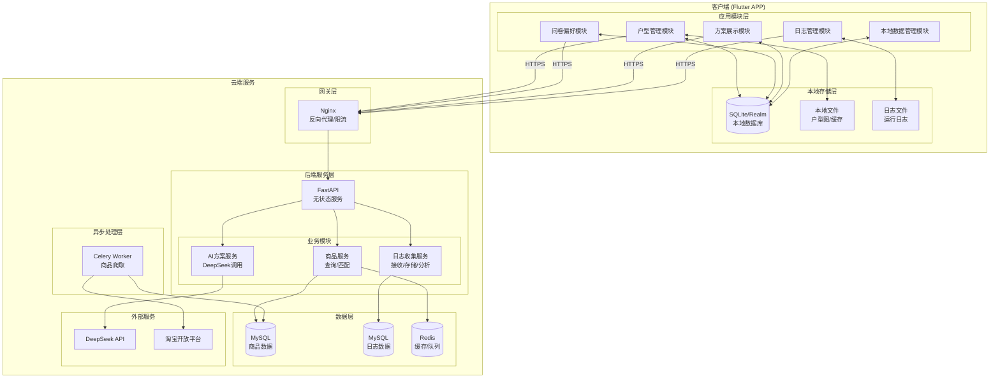
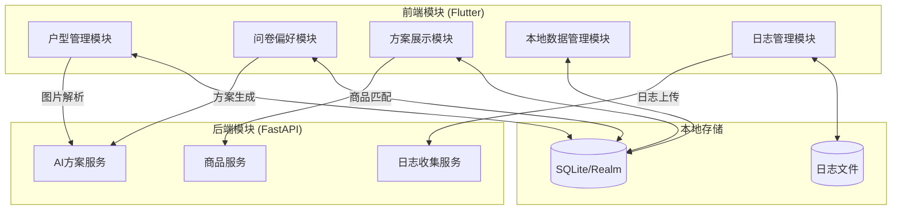
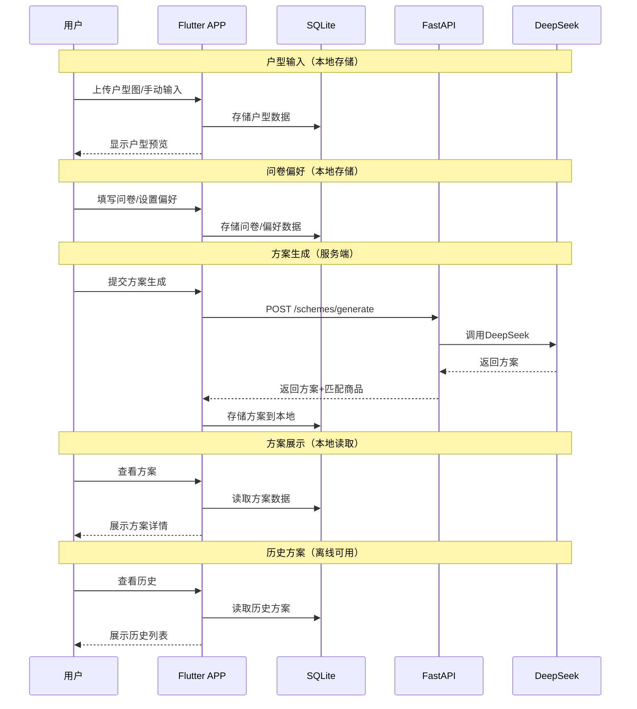
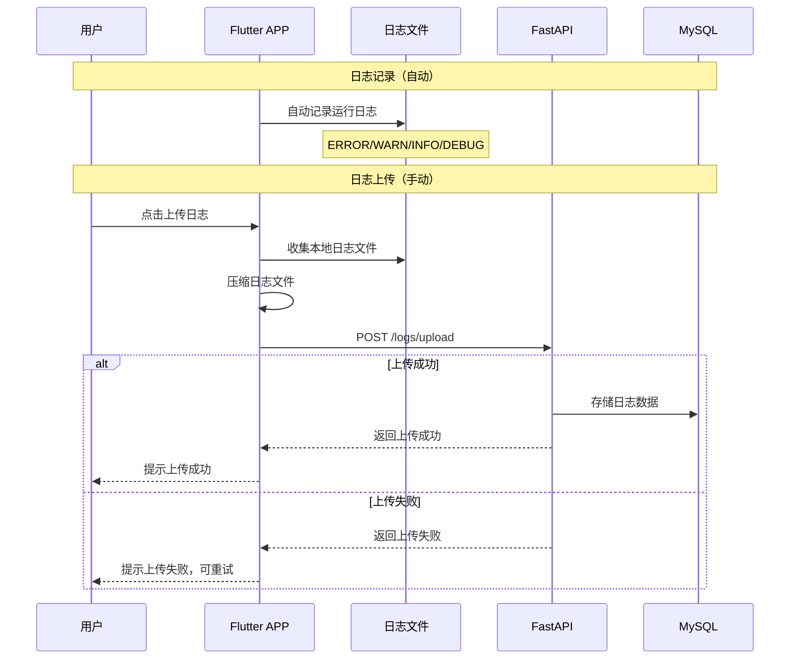
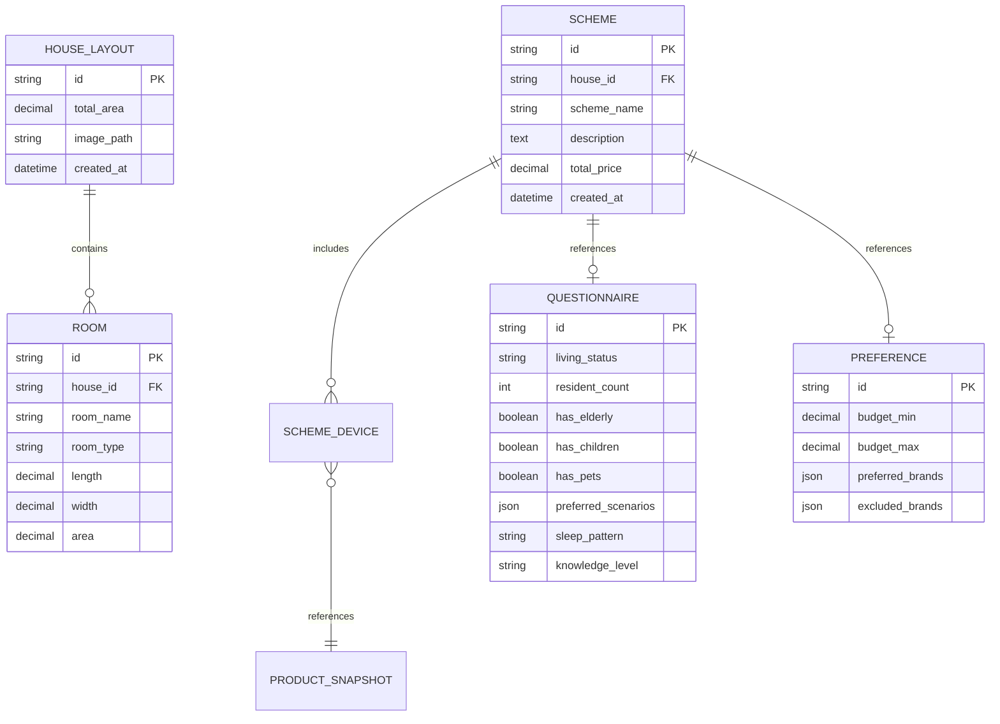
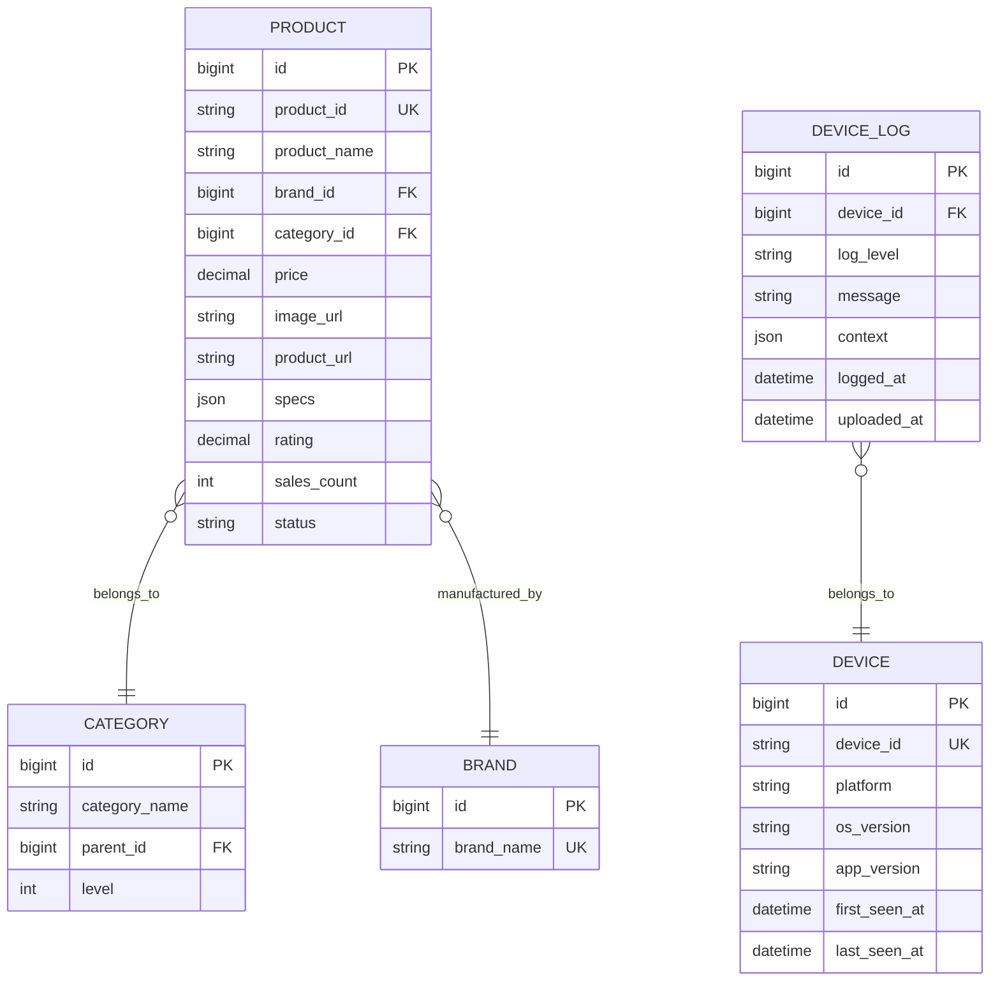
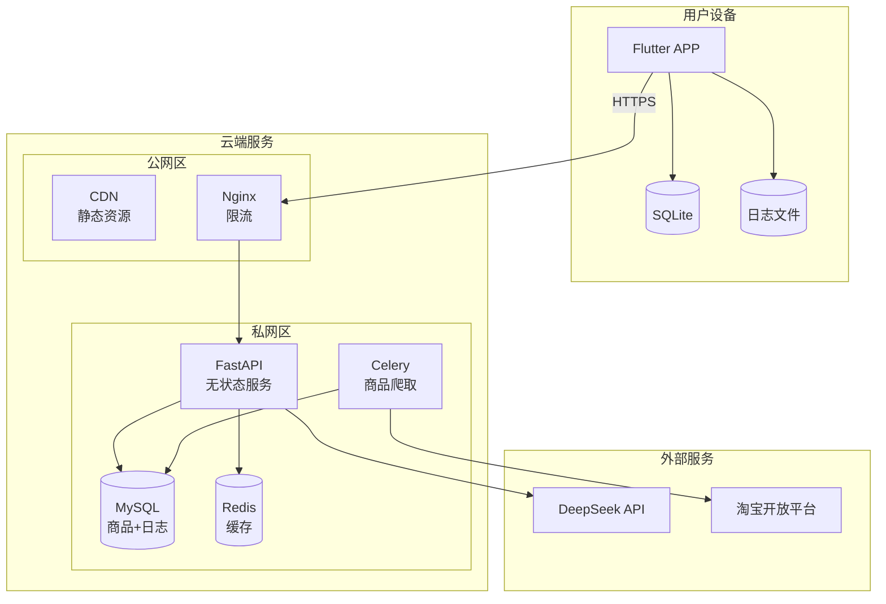

# 智能家居方案设计APP 系统架构文档

| 文档版本 | 修改日期   | 修改人 | 修改内容 |
|----------|------------|--------|----------|
| v1.0     | 2026-03-21 | 架构师 | 初稿     |
| v1.1     | 2026-03-21 | 架构师 | 适配PRD v1.1：移除用户登录，改为设备级匿名使用模式 |
| v1.2     | 2026-03-24 | 架构师 | 适配PRD v1.2：新增日志管理模块和日志收集服务 |

---

## 一、文档说明

### 1.1 文档目的

本文档定义智能家居方案设计APP的系统架构，包括技术选型、模块划分、交互规范等，为开发团队提供明确的"施工图纸"。

### 1.2 相关文档

| 文档 | 路径 | 说明 |
|------|------|------|
| 产品需求文档 | [../PRD/PRD.md](../PRD/PRD.md) | 业务需求来源 |
| API规范 | [API.md](./API.md) | 接口通用规范 |
| 数据模型 | [DATABASE.md](./DATABASE.md) | 数据库设计 |

### 1.3 架构变更历史

#### v1.2 变更（2026-03-24）

> **新增日志管理功能**
> 
> - **客户端**：新增日志管理模块，支持日志记录和上传
> - **服务端**：新增日志收集服务，支持日志接收、存储和分析
> - **数据存储**：本地日志文件存储，服务端日志数据库存储

#### v1.1 变更（2026-03-21）

> **移除用户登录**
> 
> - **移除用户登录**：改为设备级匿名使用模式
> - **数据存储本地化**：用户数据存储在本地设备，服务端仅存储商品数据
> - **后端无状态化**：服务端不存储用户会话和业务数据

### 1.4 开发人员指引

> 系统架构已定，模块边界与通信方式已在本文档中明确。请开发人员在此基础上进行详细设计：
> - **模块内部实现逻辑**：由开发人员自行决定
> - **本地数据存储**：使用SQLite/Realm存储用户数据，文件系统存储日志
> - **服务端交互**：用于方案生成、商品查询和日志上传

---

## 二、系统架构概览

### 2.1 架构风格

采用**客户端-服务端分离架构**，客户端负责数据存储和展示，服务端提供无状态的AI生成、商品查询和日志收集服务。

### 2.2 架构特点

| 特点 | 说明 |
|------|------|
| **无用户体系** | 设备级匿名使用，无需注册登录 |
| **本地优先** | 用户数据存储在本地设备 |
| **服务端无状态** | 服务端不存储用户会话和业务数据 |
| **离线可用** | 历史方案可离线查看 |
| **日志可追溯** | 支持日志记录和上传，便于问题排查 |

### 2.3 系统架构图



---

## 三、技术栈

### 3.1 技术选型总览

| 层级 | 技术选型 | 版本 | 选型理由 |
|------|----------|------|----------|
| **前端框架** | Flutter | 3.x | 跨平台（iOS/Android），性能接近原生 |
| **本地数据库** | SQLite / Realm | - | 本地数据持久化，离线可用 |
| **本地日志** | Logger + 文件系统 | - | 结构化日志，文件存储 |
| **后端框架** | Python + FastAPI | 3.11 / 0.100+ | 与AI生态无缝集成，无状态服务 |
| **数据库** | MySQL | 8.0 | 商品数据、日志数据存储 |
| **缓存** | Redis | 7.0 | 商品缓存、任务队列 |
| **异步任务** | Celery | 5.x | 商品数据爬取 |
| **AI服务** | DeepSeek API | - | PRD要求，方案生成 |
| **数据源** | 淘宝开放平台 | - | PRD要求，商品数据 |
| **Web服务器** | Nginx | 1.24+ | 反向代理、限流 |

### 3.2 技术架构决策记录

| 决策ID | 决策点 | 选择 | 理由 | 替代方案 |
|--------|--------|------|------|----------|
| ADR-001 | 用户体系 | 无用户登录 | PRD要求，降低使用门槛 | 用户注册登录 |
| ADR-002 | 数据存储 | 本地优先 | 隐私保护，离线可用 | 服务端存储 |
| ADR-003 | 服务端架构 | 无状态 | 简化架构，易于扩展 | 有状态服务 |
| ADR-004 | 本地数据库 | SQLite/Realm | 轻量级，Flutter友好 | SharedPreferences |
| ADR-005 | 前端框架 | Flutter | 跨平台，性能好 | React Native |
| ADR-006 | 日志存储 | 本地文件 + 服务端数据库 | 本地实时记录，服务端持久化分析 | 仅本地存储 |

---

## 四、模块划分

### 4.1 模块总览



### 4.2 前端模块职责

| 模块 | 职责范围 | 本地存储 | 服务端交互 |
|------|----------|----------|------------|
| **户型管理模块** | 户型图上传、手动输入、户型预览 | 户型数据 | 图片解析（可选） |
| **问卷偏好模块** | 问卷调查、预算设置、品牌偏好 | 问卷/偏好数据 | 方案生成请求 |
| **方案展示模块** | 方案详情、设备详情、购买跳转 | 方案数据 | 商品匹配请求 |
| **本地数据管理模块** | 历史方案查看、数据清除、数据导出 | 全部本地数据 | 无 |
| **日志管理模块** | 日志记录、日志上传、日志清理 | 日志文件 | 日志上传 |

### 4.3 后端模块职责

| 模块 | 职责范围 | 核心功能 | 数据存储 |
|------|----------|----------|----------|
| **AI方案服务** | AI方案生成、图片解析 | DeepSeek调用、方案生成 | 无状态，不存储 |
| **商品服务** | 商品查询、商品匹配 | 商品查询、预算匹配 | 商品数据（MySQL） |
| **日志收集服务** | 日志接收、存储、分析 | 日志接收、设备关联、问题分析 | 日志数据（MySQL） |

### 4.4 数据流向

```
┌──────────────────────────────────────────────────────────────────┐
│                          数据流向                                 │
├──────────────────────────────────────────────────────────────────┤
│                                                                  │
│  用户数据（本地）：                                               │
│  ┌─────────────┐    ┌─────────────┐    ┌─────────────┐          │
│  │ 户型数据    │───▶│ 问卷偏好    │───▶│ 方案数据    │          │
│  │ (SQLite)   │    │ (SQLite)   │    │ (SQLite)   │          │
│  └─────────────┘    └─────────────┘    └─────────────┘          │
│                                                                  │
│  日志数据（本地 → 服务端）：                                      │
│  ┌─────────────┐    ┌─────────────┐    ┌─────────────┐          │
│  │ 运行日志    │───▶│ 用户上传    │───▶│ 服务端存储  │          │
│  │ (本地文件)  │    │ (手动触发)  │    │ (MySQL)    │          │
│  └─────────────┘    └─────────────┘    └─────────────┘          │
│                                                                  │
│  服务端数据（云端）：                                             │
│  ┌─────────────┐    ┌─────────────┐                              │
│  │ 商品数据    │◀───│ 淘宝API     │                              │
│  │ (MySQL)    │    │ (爬取)     │                              │
│  └─────────────┘    └─────────────┘                              │
│                                                                  │
└──────────────────────────────────────────────────────────────────┘
```

---

## 五、交互规范

### 5.1 通信机制

| 交互场景 | 通信方式 | 技术实现 | 说明 |
|----------|----------|----------|------|
| 客户端 ↔ 服务端 | 同步HTTP | RESTful API | 方案生成、商品查询、日志上传 |
| AI方案生成 | 同步HTTP | DeepSeek API | 服务端调用，返回结果 |
| 商品数据爬取 | 异步处理 | Celery + Redis | 定时任务 |
| 日志上传 | 同步HTTP | RESTful API | 用户手动触发 |

### 5.2 核心业务流程



### 5.3 日志上传流程



### 5.4 外部服务集成

| 服务 | 用途 | 调用方式 | 超时 | 重试 |
|------|------|----------|------|------|
| DeepSeek AI | 方案生成 | HTTP API | 30s | 2次 |
| 淘宝开放平台 | 商品数据爬取 | HTTP API | 10s | 3次 |

---

## 六、数据架构

### 6.1 数据存储策略

| 数据类型 | 存储位置 | 说明 |
|----------|----------|------|
| 户型数据 | 本地SQLite | 用户输入的户型信息 |
| 问卷数据 | 本地SQLite | 用户填写的问卷答案 |
| 偏好数据 | 本地SQLite | 用户设置的预算、品牌偏好 |
| 方案数据 | 本地SQLite | AI生成的方案及匹配商品 |
| 户型图片 | 本地文件系统 | 用户上传的户型图 |
| **运行日志** | **本地文件系统** | **APP运行日志（ERROR/WARN/INFO/DEBUG）** |
| 商品数据 | 服务端MySQL | 淘宝商品信息 |
| 商品缓存 | 服务端Redis | 热门商品缓存 |
| **上传日志** | **服务端MySQL** | **用户上传的日志数据** |

### 6.2 本地数据模型

详细数据模型见 [DATABASE.md](./DATABASE.md)



### 6.3 服务端数据模型



---

## 七、部署架构

### 7.1 部署拓扑



### 7.2 环境规划

| 环境 | 用途 | 配置 |
|------|------|------|
| 开发环境 | 开发调试 | 本地运行，Mock服务 |
| 测试环境 | 功能测试 | 单机部署 |
| 生产环境 | 正式运行 | 单机/多节点 |

---

## 八、非功能性需求

### 8.1 性能指标

| 指标 | 目标值 | 说明 |
|------|--------|------|
| API响应时间 | < 200ms | P99，不含AI生成 |
| AI生成时间 | < 15s | 含商品匹配 |
| 本地查询 | < 50ms | SQLite查询 |
| 离线可用 | 支持 | 历史方案离线查看 |
| 日志上传 | < 10s | 单次上传（5MB以内） |

### 8.2 安全措施

| 安全项 | 措施 |
|--------|------|
| 传输安全 | HTTPS加密传输 |
| 接口安全 | 限流、参数校验 |
| 本地数据 | 应用沙盒隔离 |
| 隐私保护 | 业务数据不上传服务端 |
| 日志脱敏 | 敏感信息不记录日志 |

### 8.3 可观测性

| 类型 | 工具 | 说明 |
|------|------|------|
| 服务端日志 | ELK / 阿里云SLS | API调用日志 |
| 服务端监控 | Prometheus + Grafana | 系统指标监控 |
| 客户端日志 | 本地日志文件 + 上传 | 问题排查 |
| 客户端日志分析 | 服务端日志分析 | 问题定位、用户行为分析 |

---

## 九、附录

### 9.1 目录结构建议

```
smart_home_deg/
├── docs/                    # 文档目录
│   ├── PRD/                # 产品需求文档
│   ├── ARCH/               # 架构文档
│   ├── DEV/                # 开发文档
│   └── ...
├── frontend/               # Flutter前端
│   ├── lib/
│   │   ├── modules/        # 功能模块
│   │   │   ├── house/      # 户型管理模块
│   │   │   ├── survey/     # 问卷偏好模块
│   │   │   ├── scheme/     # 方案展示模块
│   │   │   ├── local/      # 本地数据管理模块
│   │   │   └── logger/     # 日志管理模块
│   │   ├── core/           # 核心组件
│   │   ├── shared/         # 共享组件
│   │   └── data/           # 本地数据层
│   │       ├── database/   # SQLite数据库
│   │       ├── models/     # 数据模型
│   │       └── logger/     # 日志管理
│   └── pubspec.yaml
├── backend/                # FastAPI后端
│   ├── app/
│   │   ├── modules/        # 业务模块
│   │   │   ├── ai/         # AI方案服务
│   │   │   ├── product/    # 商品服务
│   │   │   └── log/        # 日志收集服务
│   │   ├── core/           # 核心组件
│   │   └── shared/         # 共享组件
│   ├── celery_tasks/       # 异步任务
│   └── requirements.txt
├── scripts/                # 部署脚本
└── docker/                 # Docker配置
```

### 9.2 开发规范参考

| 规范 | 说明 |
|------|------|
| 代码风格 | Python: PEP8, Dart: Effective Dart |
| 分支管理 | Git Flow |
| 提交规范 | Conventional Commits |
| 代码审查 | 必须经过Code Review |
| 日志规范 | 统一日志格式，敏感信息脱敏 |

---

## 十、版本历史

| 版本 | 日期 | 修改内容 | 修改人 |
|------|------|----------|--------|
| v1.0 | 2026-03-21 | 初稿 | 架构师 |
| v1.1 | 2026-03-21 | 适配PRD v1.1：移除用户登录，改为设备级匿名使用模式 | 架构师 |
| v1.2 | 2026-03-24 | 适配PRD v1.2：新增日志管理模块和日志收集服务 | 架构师 |
