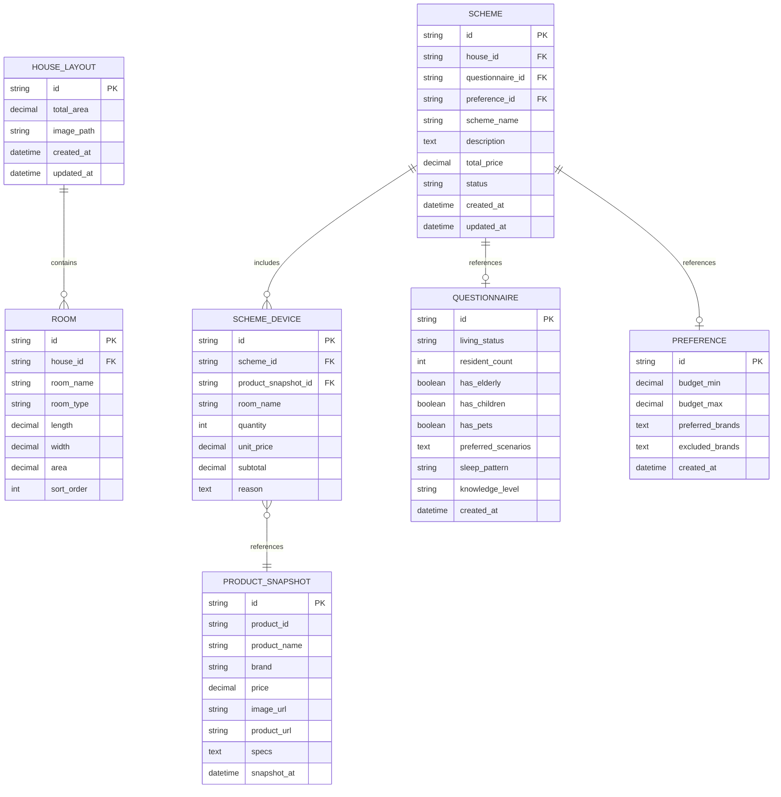
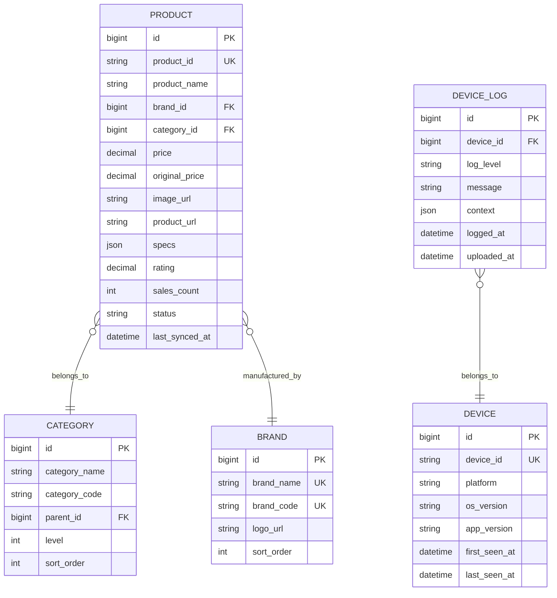

# 数据模型设计

| 文档版本 | 修改日期   | 修改人 | 修改内容 |
|----------|------------|--------|----------|
| v1.0     | 2026-03-21 | 架构师 | 初稿     |
| v1.1     | 2026-03-21 | 架构师 | 适配PRD v1.1：移除用户表，新增本地存储设计 |
| v1.2     | 2026-03-24 | 架构师 | 适配PRD v1.2：新增本地日志存储和服务端日志表 |

---

## 一、数据存储架构

### 1.1 存储策略概览

根据PRD v1.2，采用**本地优先**的数据存储策略：

| 数据类型 | 存储位置 | 技术选型 | 说明 |
|----------|----------|----------|------|
| 用户业务数据 | 本地设备 | SQLite / Realm | 户型、问卷、偏好、方案 |
| 用户文件数据 | 本地设备 | 文件系统 | 户型图片、缓存 |
| **运行日志** | **本地设备** | **文件系统** | **APP运行日志** |
| 商品数据 | 服务端 | MySQL | 淘宝商品信息 |
| 商品缓存 | 服务端 | Redis | 热门商品缓存 |
| **设备日志** | **服务端** | **MySQL** | **用户上传的日志数据** |

### 1.2 数据流向

```
┌─────────────────────────────────────────────────────────────────┐
│                        数据存储架构                              │
├─────────────────────────────────────────────────────────────────┤
│                                                                 │
│  ┌─────────────────────────────────────────────────────────┐   │
│  │                    客户端 (Flutter APP)                   │   │
│  │  ┌─────────────┐  ┌─────────────┐  ┌─────────────┐      │   │
│  │  │ 户型数据    │  │ 问卷偏好    │  │ 方案数据    │      │   │
│  │  │ (SQLite)   │  │ (SQLite)   │  │ (SQLite)   │      │   │
│  │  └─────────────┘  └─────────────┘  └─────────────┘      │   │
│  │  ┌─────────────┐  ┌─────────────┐                        │   │
│  │  │ 户型图片    │  │ 运行日志    │                        │   │
│  │  │ (文件系统)  │  │ (文件系统)  │                        │   │
│  │  └─────────────┘  └─────────────┘                        │   │
│  └─────────────────────────────────────────────────────────┘   │
│                              │                                  │
│                              │ HTTP API                         │
│                              ▼                                  │
│  ┌─────────────────────────────────────────────────────────┐   │
│  │                    服务端 (FastAPI)                       │   │
│  │  ┌─────────────┐  ┌─────────────┐  ┌─────────────┐      │   │
│  │  │ 商品数据    │  │ 商品缓存    │  │ 设备日志    │      │   │
│  │  │ (MySQL)    │  │ (Redis)    │  │ (MySQL)    │      │   │
│  │  └─────────────┘  └─────────────┘  └─────────────┘      │   │
│  └─────────────────────────────────────────────────────────┘   │
│                                                                 │
└─────────────────────────────────────────────────────────────────┘
```

---

## 二、本地数据模型（SQLite）

### 2.1 本地ER图



### 2.2 本地表结构

#### house_layouts 表（户型）

| 字段名 | 类型 | 必填 | 说明 |
|--------|------|------|------|
| id | TEXT | 是 | 主键，UUID |
| total_area | REAL | 是 | 总面积（平方米） |
| image_path | TEXT | 否 | 户型图本地路径 |
| created_at | TEXT | 是 | 创建时间（ISO8601） |
| updated_at | TEXT | 是 | 更新时间（ISO8601） |

#### rooms 表（房间）

| 字段名 | 类型 | 必填 | 说明 |
|--------|------|------|------|
| id | TEXT | 是 | 主键，UUID |
| house_id | TEXT | 是 | 户型ID，外键 |
| room_name | TEXT | 是 | 房间名称 |
| room_type | TEXT | 是 | 房间类型编码 |
| length | REAL | 是 | 长度（米） |
| width | REAL | 是 | 宽度（米） |
| area | REAL | 是 | 面积（平方米） |
| sort_order | INTEGER | 是 | 排序序号 |

#### questionnaires 表（问卷）

| 字段名 | 类型 | 必填 | 说明 |
|--------|------|------|------|
| id | TEXT | 是 | 主键，UUID |
| living_status | TEXT | 是 | 居住情况：own/rent |
| resident_count | INTEGER | 是 | 常住人数 |
| has_elderly | INTEGER | 是 | 是否有老人（0/1） |
| has_children | INTEGER | 是 | 是否有儿童（0/1） |
| has_pets | INTEGER | 是 | 是否有宠物（0/1） |
| preferred_scenarios | TEXT | 是 | 偏好场景（JSON数组） |
| sleep_pattern | TEXT | 是 | 作息习惯 |
| knowledge_level | TEXT | 是 | 了解程度 |
| created_at | TEXT | 是 | 创建时间 |

#### preferences 表（偏好）

| 字段名 | 类型 | 必填 | 说明 |
|--------|------|------|------|
| id | TEXT | 是 | 主键，UUID |
| budget_min | REAL | 是 | 最小预算 |
| budget_max | REAL | 是 | 最大预算 |
| preferred_brands | TEXT | 否 | 偏好品牌（JSON数组） |
| excluded_brands | TEXT | 否 | 排除品牌（JSON数组） |
| created_at | TEXT | 是 | 创建时间 |

#### schemes 表（方案）

| 字段名 | 类型 | 必填 | 说明 |
|--------|------|------|------|
| id | TEXT | 是 | 主键，UUID |
| house_id | TEXT | 是 | 户型ID |
| questionnaire_id | TEXT | 是 | 问卷ID |
| preference_id | TEXT | 是 | 偏好ID |
| scheme_name | TEXT | 是 | 方案名称 |
| description | TEXT | 是 | 方案描述 |
| total_price | REAL | 是 | 方案总价 |
| status | TEXT | 是 | 状态：pending/success/failed |
| created_at | TEXT | 是 | 创建时间 |
| updated_at | TEXT | 是 | 更新时间 |

#### scheme_devices 表（方案设备）

| 字段名 | 类型 | 必填 | 说明 |
|--------|------|------|------|
| id | TEXT | 是 | 主键，UUID |
| scheme_id | TEXT | 是 | 方案ID |
| product_snapshot_id | TEXT | 是 | 商品快照ID |
| room_name | TEXT | 是 | 放置房间 |
| quantity | INTEGER | 是 | 数量 |
| unit_price | REAL | 是 | 单价 |
| subtotal | REAL | 是 | 小计 |
| reason | TEXT | 否 | 推荐理由 |

#### product_snapshots 表（商品快照）

| 字段名 | 类型 | 必填 | 说明 |
|--------|------|------|------|
| id | TEXT | 是 | 主键，UUID |
| product_id | TEXT | 是 | 淘宝商品ID |
| product_name | TEXT | 是 | 商品名称 |
| brand | TEXT | 否 | 品牌名称 |
| price | REAL | 是 | 价格 |
| image_url | TEXT | 是 | 商品图片URL |
| product_url | TEXT | 是 | 商品详情页URL |
| specs | TEXT | 否 | 商品规格（JSON） |
| snapshot_at | TEXT | 是 | 快照时间 |

---

## 三、本地日志存储（文件系统）

### 3.1 日志存储策略

| 配置项 | 值 | 说明 |
|--------|-----|------|
| 存储位置 | 应用沙盒目录/logs | 本地文件系统 |
| 日志格式 | JSON Lines | 每行一条日志记录 |
| 文件命名 | app_YYYYMMDD.log | 按日期分文件 |
| 保留天数 | 7天 | 自动清理过期日志 |
| 单文件大小 | 5MB | 超过则滚动创建新文件 |
| 总存储上限 | 50MB | 超过则清理最旧日志 |

### 3.2 日志数据结构

每条日志记录采用JSON格式：

```json
{
  "timestamp": "2026-03-24T10:30:45.123Z",
  "level": "ERROR",
  "message": "API请求失败",
  "context": {
    "deviceId": "a1b2c3d4-e5f6-7890-abcd-ef1234567890",
    "appVersion": "1.0.0",
    "platform": "android",
    "osVersion": "13",
    "apiEndpoint": "/api/scheme/generate",
    "errorCode": "TIMEOUT",
    "stackTrace": "..."
  }
}
```

### 3.3 日志级别定义

| 级别 | 编码 | 使用场景 | 示例 |
|------|------|----------|------|
| ERROR | ERROR | 严重错误，影响功能 | API请求失败、数据解析异常 |
| WARN | WARN | 警告，不影响主流程 | 网络超时重试、缓存失效 |
| INFO | INFO | 重要业务信息 | 方案生成成功、页面访问 |
| DEBUG | DEBUG | 调试信息 | 详细请求参数、内部状态 |

### 3.4 日志文件示例

```
{"timestamp":"2026-03-24T10:00:00.000Z","level":"INFO","message":"应用启动","context":{"deviceId":"xxx","appVersion":"1.0.0"}}
{"timestamp":"2026-03-24T10:01:23.456Z","level":"INFO","message":"用户进入户型管理页面","context":{}}
{"timestamp":"2026-03-24T10:02:15.789Z","level":"WARN","message":"户型图上传超时，正在重试","context":{"retryCount":1}}
{"timestamp":"2026-03-24T10:05:30.123Z","level":"ERROR","message":"方案生成失败","context":{"errorCode":"AI_TIMEOUT","errorMessage":"DeepSeek API响应超时"}}
```

### 3.5 日志清理策略

```
┌─────────────────────────────────────────────────────────────────┐
│                      日志清理策略                                │
├─────────────────────────────────────────────────────────────────┤
│                                                                 │
│  触发条件：                                                      │
│  1. 应用启动时检查                                               │
│  2. 每日定时检查（可选）                                          │
│                                                                 │
│  清理规则：                                                      │
│  1. 删除超过7天的日志文件                                         │
│  2. 总存储超过50MB时，删除最旧的日志文件                           │
│  3. 单文件超过5MB时，滚动创建新文件                               │
│                                                                 │
│  保留策略：                                                      │
│  - ERROR级别日志优先保留                                         │
│  - 最近3天的日志强制保留                                          │
│                                                                 │
└─────────────────────────────────────────────────────────────────┘
```

---

## 四、服务端数据模型（MySQL）

### 4.1 服务端ER图



### 4.2 服务端表结构

#### products 表（商品）

| 字段名 | 类型 | 必填 | 说明 |
|--------|------|------|------|
| id | BIGINT | 是 | 主键，自增 |
| product_id | VARCHAR(50) | 是 | 淘宝商品ID，唯一索引 |
| product_name | VARCHAR(200) | 是 | 商品名称 |
| brand_id | BIGINT | 否 | 品牌ID，外键 |
| category_id | BIGINT | 是 | 分类ID，外键 |
| price | DECIMAL(10,2) | 是 | 当前价格 |
| original_price | DECIMAL(10,2) | 否 | 原价 |
| image_url | VARCHAR(500) | 是 | 商品图片URL |
| product_url | VARCHAR(500) | 是 | 商品详情页URL |
| specs | JSON | 否 | 商品规格参数 |
| rating | DECIMAL(3,1) | 否 | 评分（0-5） |
| sales_count | INT | 否 | 销量 |
| status | TINYINT | 是 | 状态：1在售 2下架 |
| last_synced_at | DATETIME | 是 | 最后同步时间 |

#### brands 表（品牌）

| 字段名 | 类型 | 必填 | 说明 |
|--------|------|------|------|
| id | BIGINT | 是 | 主键，自增 |
| brand_name | VARCHAR(50) | 是 | 品牌名称，唯一 |
| brand_code | VARCHAR(30) | 是 | 品牌编码，唯一 |
| logo_url | VARCHAR(500) | 否 | 品牌Logo URL |
| sort_order | INT | 是 | 排序序号 |

#### categories 表（分类）

| 字段名 | 类型 | 必填 | 说明 |
|--------|------|------|------|
| id | BIGINT | 是 | 主键，自增 |
| category_name | VARCHAR(50) | 是 | 分类名称 |
| category_code | VARCHAR(30) | 是 | 分类编码 |
| parent_id | BIGINT | 否 | 父分类ID |
| level | TINYINT | 是 | 层级：1一级 2二级 |
| sort_order | INT | 是 | 排序序号 |

#### devices 表（设备）

| 字段名 | 类型 | 必填 | 说明 |
|--------|------|------|------|
| id | BIGINT | 是 | 主键，自增 |
| device_id | VARCHAR(50) | 是 | 设备唯一标识，唯一索引 |
| platform | VARCHAR(20) | 是 | 平台：android/ios |
| os_version | VARCHAR(20) | 否 | 操作系统版本 |
| app_version | VARCHAR(20) | 是 | APP版本号 |
| first_seen_at | DATETIME | 是 | 首次出现时间 |
| last_seen_at | DATETIME | 是 | 最后活跃时间 |

#### device_logs 表（设备日志）

| 字段名 | 类型 | 必填 | 说明 |
|--------|------|------|------|
| id | BIGINT | 是 | 主键，自增 |
| device_id | BIGINT | 是 | 设备ID，外键 |
| log_level | VARCHAR(10) | 是 | 日志级别：ERROR/WARN/INFO/DEBUG |
| message | VARCHAR(500) | 是 | 日志消息 |
| context | JSON | 否 | 日志上下文（JSON格式） |
| logged_at | DATETIME | 是 | 日志产生时间 |
| uploaded_at | DATETIME | 是 | 日志上传时间 |

---

## 五、数据字典

### 5.1 房间类型枚举

| 编码 | 名称 | 说明 |
|------|------|------|
| living_room | 客厅 | 主要活动空间 |
| master_bedroom | 主卧 | 主卧室 |
| second_bedroom | 次卧 | 次卧室 |
| kitchen | 厨房 | 烹饪空间 |
| bathroom | 卫生间 | 洗漱空间 |
| balcony | 阳台 | 阳台空间 |
| study | 书房 | 工作/学习空间 |
| entrance | 玄关 | 入户区域 |

### 5.2 智能场景枚举

| 编码 | 名称 | 说明 |
|------|------|------|
| lighting | 智能照明 | 灯光控制场景 |
| security | 智能安防 | 安防监控场景 |
| curtain | 智能窗帘 | 窗帘控制场景 |
| appliance | 智能家电 | 家电控制场景 |
| audio | 智能影音 | 影音娱乐场景 |
| environment | 智能环境 | 环境控制场景 |

### 5.3 商品分类体系

| 一级分类 | 二级分类 |
|----------|----------|
| 智能照明 | 智能灯泡、智能灯带、智能开关、智能吸顶灯 |
| 智能安防 | 智能门锁、智能摄像头、门窗传感器、烟雾报警器 |
| 智能窗帘 | 智能窗帘电机、智能卷帘 |
| 智能控制 | 智能插座、智能遥控器、智能音箱 |
| 智能环境 | 空气净化器、智能空调、智能加湿器 |
| 智能厨卫 | 智能马桶、智能热水器、智能洗碗机 |

### 5.4 日志级别枚举

| 编码 | 名称 | 说明 |
|------|------|------|
| ERROR | 错误 | 严重错误，影响功能 |
| WARN | 警告 | 警告信息，不影响主流程 |
| INFO | 信息 | 重要业务信息 |
| DEBUG | 调试 | 调试信息 |

---

## 六、本地数据管理

### 6.1 数据生命周期

```
┌─────────────────────────────────────────────────────────────────┐
│                      本地数据生命周期                            │
├─────────────────────────────────────────────────────────────────┤
│                                                                 │
│  业务数据：                                                      │
│  创建 ──▶ 使用 ──▶ 归档 ──▶ 清理                                │
│  1. 创建：用户输入户型/问卷/偏好，生成方案                        │
│  2. 使用：查看方案详情、购买跳转                                  │
│  3. 归档：方案超过30天自动标记为归档                              │
│  4. 清理：用户手动清除或应用卸载时删除                            │
│                                                                 │
│  日志数据：                                                      │
│  记录 ──▶ 存储 ──▶ 清理                                         │
│  1. 记录：APP运行时自动记录日志                                   │
│  2. 存储：按日期存储到本地文件                                    │
│  3. 清理：超过7天自动清理，或用户手动清理                          │
│                                                                 │
└─────────────────────────────────────────────────────────────────┘
```

### 6.2 数据导出功能

支持导出方案为以下格式：
- **PDF格式**：包含方案详情、设备列表、价格汇总
- **图片格式**：方案概览截图
- **JSON格式**：完整方案数据（用于备份）

### 6.3 数据同步策略

由于采用本地存储，**无需数据同步**。但需注意：
- 商品价格可能变动，方案中保存的是生成时的价格快照
- 用户可手动刷新商品价格（重新请求服务端）

---

## 七、服务端日志管理

### 7.1 日志保留策略

| 配置项 | 值 | 说明 |
|--------|-----|------|
| 保留天数 | 30天 | 自动清理超过30天的日志 |
| 存储上限 | 根据服务器配置 | 建议单独表空间或数据库 |
| 备份策略 | 可选 | 重要日志可归档到对象存储 |

### 7.2 日志分析能力

| 分析维度 | 说明 |
|----------|------|
| 错误统计 | 按设备、版本、错误类型统计 |
| 趋势分析 | 错误趋势、活跃设备趋势 |
| 问题定位 | 通过设备ID快速定位问题 |

---

## 八、开发人员职责

> **架构师定义**：以上为数据模型设计，定义了本地和服务端的表结构、字段及数据字典。
> 
> **开发人员职责**：
> 1. **本地数据库**：使用sqflite或drift实现SQLite数据库
> 2. **本地日志**：实现日志记录、文件管理、清理策略
> 3. **服务端数据库**：编写建表SQL、设计索引
> 4. **数据迁移**：设计数据库版本升级策略
> 5. **性能优化**：优化查询性能

---

## 九、版本历史

| 版本 | 日期 | 修改内容 | 修改人 |
|------|------|----------|--------|
| v1.0 | 2026-03-21 | 初稿 | 架构师 |
| v1.1 | 2026-03-21 | 适配PRD v1.1：移除用户表，新增本地存储设计 | 架构师 |
| v1.2 | 2026-03-24 | 适配PRD v1.2：新增本地日志存储和服务端日志表 | 架构师 |
